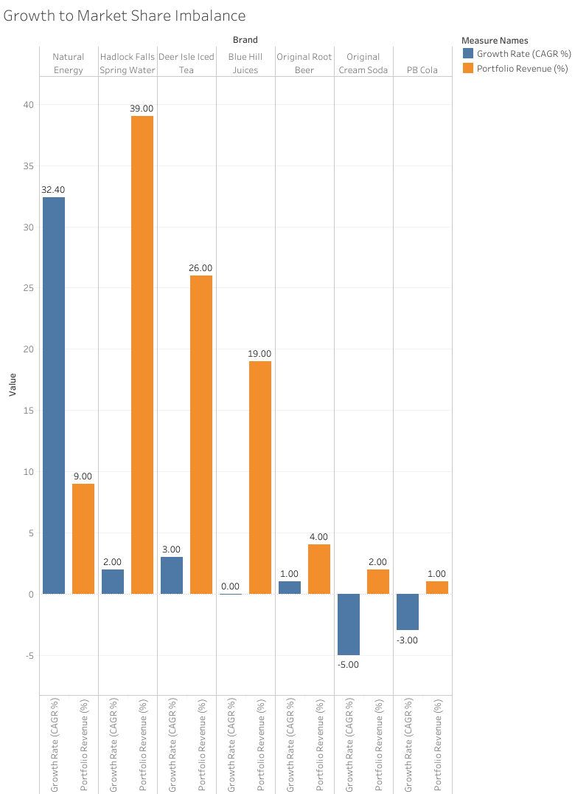

# Portfolio Growth-Share Analysis 📊
**Revealing Strategic Misalignment Through Data Visualization**

Single-metric dashboards hide portfolio problems. This analysis demonstrates how **comparative visualization** exposes the strategic disconnect between growth and revenue, a pattern invisible when metrics are analyzed separately.



---

## The Problem: Metrics in Isolation Mislead Strategy

Most portfolio reviews examine metrics separately:
- ✅ Growth rates by brand
- ✅ Revenue contribution by brand  
- ❌ **The relationship between them**

**Result:** Executives miss critical misalignments that constrain portfolio performance.

---

## The Analysis: Three Visualizations, One Strategic Insight

### Visualization 1: Growth Looks Impressive


**What executives see:** Natural Energy achieves 32.4% CAGR, a strong growth story.

**What they miss:** Context. Is this brand big enough to matter?

---

### Visualization 2: Revenue Looks Stable  


**What executives see:** Hadlock Falls generates 39% of revenue, a portfolio leader.

**What they miss:** Is this brand growing?

---

### Visualization 3: The Truth Emerges


**What comparative analysis reveals:**
- **Fastest growth (32.4% CAGR) = Smallest revenue (9%)**
- **Largest revenue (39%) = Minimal growth (2%)**

**Strategic consequence:** Portfolio cannot achieve market leadership AND revenue expansion simultaneously. These outcomes live in different brands.

---

## Business Impact: Why This Matters

This growth-share disconnect creates three strategic problems:

**Problem 1: Can't Self-Fund Growth**  
High-growth brand's 9% revenue base provides insufficient capital for market expansion.

**Problem 2: Cash Cows Limit Aggregate Growth**  
65% of revenue concentrated in 2-3% CAGR brands constrains portfolio-wide performance.

**Problem 3: Lifecycle Misalignment**  
91% of revenue in mature/declining brands, only 9% in growth phase.

---

## The Visualization Advantage

**Traditional Reporting:**
```
Brand Performance Dashboard
├── Growth Rate: 32.4% ✓ Exceeds target
├── Revenue Share: 39% ✓ Market leader
└── Conclusion: Portfolio healthy
```

**Comparative Visualization:**
```
Side-by-Side Analysis
├── High growth brand = 9% revenue
├── High revenue brand = 2% growth
└── Conclusion: Strategic misalignment requires reallocation
```

**The difference:** Comparative visualization makes invisible patterns visible.

---

## Methodology

**Tools:**
- Tableau (interactive dashboards)
- Python (data preparation)
- Excel (stakeholder presentation)

**Framework:**
- BCG Matrix (growth-share classification)
- Portfolio lifecycle analysis
- Comparative metric visualization

**Dataset:**  
Seven-brand beverage portfolio, $273.8M revenue, multiple product categories

---

## Applications Beyond This Case

This visualization approach applies to any multi-product portfolio:

- **SaaS Products:** Which subscriptions drive growth vs. revenue?
- **Retail Brands:** Which product lines need investment vs. harvesting?
- **Investment Portfolios:** Where is growth concentrated vs. capital deployed?
- **Service Lines:** Which offerings scale vs. generate cash?

**The pattern repeats:** Growth and revenue concentrate in different assets, requiring strategic resource reallocation.

---

## Key Takeaway

**Growth metrics look good. Revenue metrics look stable. But looking at them together reveals the strategic problem.**

Side-by-side visualization transforms portfolio analysis from descriptive reporting to strategic insight.

---

## Repository Contents 📁

```
📁 data/
├── ODC_Portfolio_Analysis_Tableau.csv
└── ODC_Portfolio_Analysis_Complete.xlsx

📁 visualizations/
├── Chart1_Growth_Only.png
├── Chart2_MarketShare_Only.png  
└── Growth_to_Market_Share_Imbalance.png

📁 tableau/
└── ODC_Portfolio_Dashboard.twbx
```

---

## Contact & Connect 📫

**Interested in portfolio analytics revealing hidden strategic tensions?**
- [LinkedIn Profile](https://www.linkedin.com/in/melissaslawsky/)
- [Client Results](https://melissaslawsky.com/portfolio/)
- [Tableau Portfolio](https://public.tableau.com/app/profile/melissa.slawsky1925/vizzes)
- [Email](mailto:melissa@melissaslawsky.com)

---

© Melissa Slawsky 2025. All Rights Reserved.
